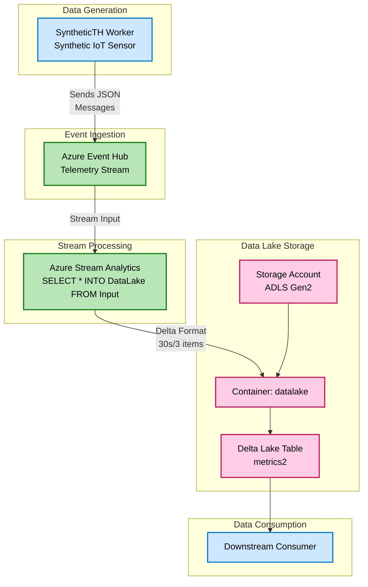

# Azure Data Lake Storage Gen2 with Delta Lake

A complete end-to-end solution demonstrating how to stream IoT telemetry data from Azure Event Hubs through Azure Stream Analytics into an Azure Data Lake Storage Gen2 account, with output stored in Delta Lake format.

## Overview

This project showcases a production-ready data ingestion pipeline that:

- **Generates** synthetic IoT sensor data (temperature and humidity)
- **Streams** data through Azure Event Hubs
- **Processes** data in real-time using Azure Stream Analytics
- **Stores** data in Delta Lake format on Azure Data Lake Storage Gen2
- **Enables** downstream consumption using specified Service Principal
- **Uses** passwordless authentication throughout (Managed Identities and Service Principals with RBAC)

## Architecture



## Key Features

✅ **Delta Lake Format** - ACID transactions, schema enforcement, and time travel capabilities  
✅ **Passwordless Authentication** - Azure Managed Identities and Service Principal RBAC  
✅ **Infrastructure as Code** - Complete Bicep templates for reproducible deployments  
✅ **Multiple Deployment Options** - Local development, Docker, and Azure Container Apps  
✅ **Real-time Processing** - Stream Analytics with minimal latency (30-second windows)  
✅ **Synthetic Data Generation** - Configurable IoT telemetry simulator for testing

## Project Structure

```
AzStorage.DeltaLake/
├── src/
│   └── SyntheticTH/              # IoT telemetry data generator (worker service)
├── infra/                        # Bicep infrastructure templates
│   ├── main.bicep                # Main deployment template
│   ├── Provision-Resources.ps1   # Deployment automation script
│   ├── Create-AppSecret.ps1      # Service principal secret generation
│   └── AzDeploy.Bicep/           # Reusable Bicep module library (submodule)
├── docker/                       # Docker configuration and compose files
└── scripts/                      # Build and deployment scripts
```

## Components

### SyntheticTH Worker Service

A .NET background service that generates synthetic temperature and humidity sensor data and publishes it to Azure Event Hubs.

**Key Features:**
- Configurable message generation (count and frequency)
- Session-based tracking with unique IDs
- Multiple authentication methods (ClientSecret, ManagedIdentity, DefaultAzureCredential)
- Structured logging for observability

📖 **Documentation:** [`src/SyntheticTH/README.md`](src/SyntheticTH/README.md)

### Infrastructure

Complete Azure infrastructure provisioned via Bicep templates.

**Resources Created:**
- App Registration & Service Principal (for data sender authentication)
- Azure Event Hub Namespace and Hub
- Azure Storage Account (ADLS Gen2 with hierarchical namespace)
- User-Assigned Managed Identity (for Stream Analytics)
- Azure Stream Analytics Job (with Delta Lake output)

📖 **Documentation:** [`infra/README.md`](infra/README.md)

## Getting Started

### Prerequisites

- [.NET 10.0 SDK](https://dotnet.microsoft.com/download) or later
- [Azure CLI](https://learn.microsoft.com/cli/azure/install-azure-cli)
- [Azure subscription](https://azure.microsoft.com/free/) with appropriate permissions
- [PowerShell](https://learn.microsoft.com/powershell/scripting/install/installing-powershell) (for deployment scripts)

### Quick Start

#### 1. Provision Azure Infrastructure

```powershell
cd infra
./Provision-Resources.ps1
```

This script will:
- Deploy all required Azure resources
- Configure RBAC permissions
- Output configuration values for the next steps

**Note:** Save the output configuration values—you'll need them for the next step.

#### 2. Configure the Application

Create a `config.toml` file in the `src/SyntheticTH/` directory:

```toml
[EventHub]
Namespace = "ehns-xxxxx"          # From deployment output
Name = "ehub-xxxxx"                # From deployment output
ServiceBusEndpoint = "https://ehns-xxxxx.servicebus.windows.net/"
```

For local development, that's all you need (uses your Azure CLI credentials).

For Docker deployments, you'll also need the `[Identity]` section. Generate it with:

```powershell
cd infra
./Create-AppSecret.ps1 -AppId <senderAppId-from-output>
```

#### 3. Run the Application Locally

```bash
cd src/SyntheticTH
dotnet run
```

The worker will start generating and sending synthetic sensor data to your Event Hub.

#### 4. Verify Data Flow

After a few minutes, check your Azure Storage Account:

1. Navigate to your Storage Account in the Azure Portal
2. Go to **Containers** → **datalake** → **metrics2**
3. You should see Delta Lake files (Parquet format with transaction log)

## Deployment Options

### Local Development

Run the worker service directly with .NET:

```bash
cd src/SyntheticTH
dotnet run
```

**Authentication:** Uses DefaultAzureCredential (Azure CLI, Visual Studio, etc.)

### Docker

Build and run in Docker containers:

```powershell
# Build the image
./scripts/Build-Containers.ps1

# Create docker/config.toml with EventHub and Identity sections
# (See infra/README.md for details)

# Run the container
./scripts/Start-Containers.ps1
```

**Authentication:** Requires Service Principal credentials in `config.toml`

### Azure Container Apps

Deploy as a managed container application in Azure:

1. Build and push the Docker image to Azure Container Registry
2. Deploy to Azure Container Apps with system-assigned Managed Identity
3. Grant the Managed Identity "Azure Event Hubs Data Sender" role
4. Configure Event Hub connection via environment variables or mounted config

**Authentication:** Uses Managed Identity (no secrets needed)

## Configuration Reference

### EventHub Section

| Setting | Description | Required |
|---------|-------------|----------|
| `Namespace` | Event Hub namespace name | Yes |
| `Name` | Event Hub name | Yes |
| `ServiceBusEndpoint` | Full HTTPS endpoint URL | Yes |

### Worker Section

| Setting | Description | Default |
|---------|-------------|---------|
| `NumberOfMessages` | Messages per batch | 3 |
| `DelayBetweenRuns` | Delay between batches (HH:MM:SS) | 00:05:00 |

### Identity Section

| Setting | Description | Required For |
|---------|-------------|--------------|
| `TenantId` | Azure tenant ID | Docker, Container Apps |
| `AppId` | Service principal application ID | Docker, Container Apps |
| `AppSecret` | Service principal client secret | Docker only |

📖 **Full Configuration Guide:** [`src/SyntheticTH/README.md`](src/SyntheticTH/README.md)

## Message Format

Messages sent to Event Hub follow this JSON schema:

```json
{
  "TimeGenerated": "2026-02-28T01:23:45.678Z",
  "SequenceNumber": 1,
  "Model": "dtmi:synthetic:sensors:TH;1",
  "Metrics": {
    "Temperature": 31.0,
    "Humidity": 61.0,
    "TempCorrection": 0.05,
    "HumidityCorrection": 0.001
  },
  "SessionId": "a1b2c3d4-e5f6-7890-abcd-ef1234567890"
}
```

## Authentication & Security

This project follows Azure security best practices:

- **No connection strings** - All authentication uses Azure AD identities
- **RBAC roles** - Least-privilege access control
  - Stream Analytics → Event Hub: "Data Receiver" role
  - Stream Analytics → Storage: "Blob Data Contributor" role
  - SyntheticTH → Event Hub: "Data Sender" role
- **Managed Identities** - Used wherever possible (Stream Analytics, Container Apps)
- **Service Principals** - Used for local Docker containers

## Development

### Local Build

```bash
cd src/SyntheticTH
dotnet build
```

### Docker Build

```powershell
./scripts/Build-Containers.ps1
```

## Troubleshooting

### "Unable to send events to Event Hub"

- Verify your Azure identity has "Azure Event Hubs Data Sender" role
- Check Event Hub configuration in `config.toml`
- Run `az login` if using DefaultAzureCredential

### "No data appearing in Storage Account"

- Verify Stream Analytics job is **Running** (not just Started)
- Check Stream Analytics job metrics in Azure Portal
- Ensure Managed Identity has "Storage Blob Data Contributor" role
- Wait at least 30 seconds (the batching window)

### Docker Container Not Starting

- Ensure `[Identity]` section is complete in `docker/config.toml`
- Verify Service Principal credentials are correct
- Check container logs: `docker logs syntheticht`

📖 **More Details:** [`infra/README.md`](infra/README.md) | [`src/SyntheticTH/README.md`](src/SyntheticTH/README.md)

## Documentation

- **[Infrastructure Setup](infra/README.md)** - Detailed provisioning guide with architecture diagrams
- **[SyntheticTH Worker](src/SyntheticTH/README.md)** - Application configuration and deployment

## Technology Stack

- **.NET 10.0** - Modern cross-platform application framework
- **Azure Event Hubs** - Distributed streaming platform
- **Azure Stream Analytics** - Real-time data processing
- **Azure Data Lake Storage Gen2** - Scalable data lake with hierarchical namespace
- **Delta Lake** - ACID-compliant data lake format (Parquet + transaction log)
- **Azure Managed Identities** - Passwordless authentication
- **Bicep** - Infrastructure as Code
- **Docker** - Container packaging

## License

This project is available for reference and learning purposes.

## Related Resources

- [Azure Event Hubs Documentation](https://learn.microsoft.com/azure/event-hubs/)
- [Azure Stream Analytics Documentation](https://learn.microsoft.com/azure/stream-analytics/)
- [Delta Lake Documentation](https://delta.io/)
- [Azure Data Lake Storage Gen2](https://learn.microsoft.com/azure/storage/blobs/data-lake-storage-introduction)
- [Azure Managed Identities](https://learn.microsoft.com/azure/active-directory/managed-identities-azure-resources/)
