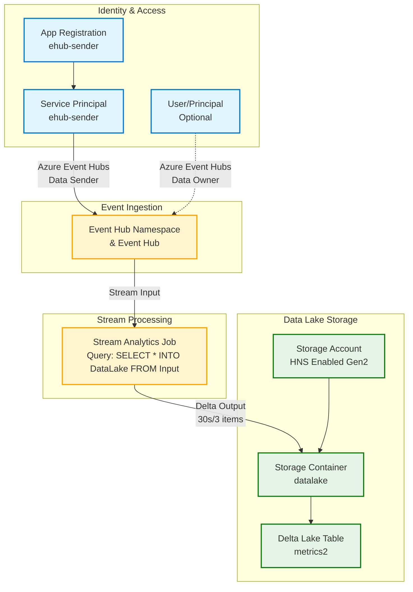

# Infrastructure

This directory contains the Bicep infrastructure-as-code templates for provisioning Azure resources required by the AzStorage.DeltaLake project.

## Overview

The infrastructure provisions a complete data ingestion pipeline that streams data from Azure Event Hubs through Azure Stream Analytics into an Azure Data Lake Storage Gen2 account, with the output stored in Delta Lake format.

## Architecture



## Data Flow

1. **Ingestion**: Applications send JSON messages to Event Hub
2. **Processing**: Stream Analytics continuously reads from Event Hub
3. **Storage**: Data is written to Delta Lake format in 30-second or 3-item batches
4. **Output**: Delta table `metrics2` in the `datalake` container

## Components

### Main Template

**[`main.bicep`](main.bicep:1)** - Primary deployment template that provisions:

1. **App Registration & Service Principal** 
   - Used by local development and Docker containers to write to Event Hub
   - Automatically assigned the "Azure Event Hubs Data Sender" role

2. **Azure Event Hub**
   - Receives streaming telemetry data
   - Configured with optional user access for debugging (Data Owner role)

3. **Azure Storage Account**
   - Data Lake Storage Gen2 (hierarchical namespace enabled)
   - Stores Delta Lake tables
   - Container: `datalake`

4. **User-Assigned Managed Identity**
   - Used by Stream Analytics Job for passwordless authentication
   - Assigned "Azure Event Hubs Data Receiver" role on Event Hub
   - Assigned "Storage Blob Data Contributor" role on Storage Container

5. **Azure Stream Analytics Job**
   - Reads JSON from Event Hub (Input)
   - Writes to Delta Lake format (DataLake output)
   - Query: `SELECT * INTO [DataLake] FROM [Input]`
   - Batch windows: 30 seconds or 3 items
   - Output path: `metrics2` Delta table

### Module Library

The [`AzDeploy.Bicep/`](AzDeploy.Bicep/README.md:1) subdirectory contains reusable Bicep modules organized by Azure service. This is imported from the [jcoliz/AzDeploy.Bicep](https://github.com/jcoliz/AzDeploy.Bicep) repository:

- **Entra/** - App registrations and service principals
- **EventHub/** - Event Hub namespaces, hubs, and role assignments
- **Storage/** - Storage accounts, containers, and RBAC roles
- **StreamAnalytics/** - Stream Analytics jobs
- **ManagedIdentity/** - User-assigned managed identities

## Authentication Model

This infrastructure uses **passwordless authentication** (Azure Managed Identities and Service Principals with RBAC) in all cases:

- **Stream Analytics → Event Hub**: Managed Identity with "Data Receiver" role
- **Stream Analytics → Storage**: Managed Identity with "Blob Data Contributor" role
- **Local/Docker → Event Hub**: Service Principal with "Data Sender" role (requires client secret)
- **User → Event Hub**: Optional direct user access with "Data Owner" role

## Deployment

### Prerequisites

- [Azure account](https://azure.microsoft.com/free/) with an active subscription
- [Azure CLI](https://learn.microsoft.com/cli/azure/install-azure-cli) installed
- [Bicep CLI](https://learn.microsoft.com/azure/azure-resource-manager/bicep/install) installed
- Appropriate Azure subscription permissions (Contributor or Owner role)

### Parameters

| Parameter | Type | Default | Description |
|-----------|------|---------|-------------|
| `location` | string | Resource group location | Primary location for all resources |
| `suffix` | string | `uniqueString(...)` | Unique suffix for resource names |
| `principalId` | string | `''` | Optional: User/SP object ID for Event Hub access |
| `principalType` | string | `'User'` | Type of principal: User, Group, or ServicePrincipal |

### Deploy with PowerShell

```powershell
# Run the provisioning script
./Provision-Resources.ps1
```

### Post-Deployment Configuration

After running [`Provision-Resources.ps1`](Provision-Resources.ps1:1), the script outputs configuration values that need to be added to a `config.toml` file.

#### For Local Development

Create a `config.toml` file in [`src/SyntheticTH/`](../src/SyntheticTH/) with the `[EventHub]` section from the deployment output:

```toml
[EventHub]
Namespace = "ehns-xxxxx"
Name = "ehub-xxxxx"
ServiceBusEndpoint = "https://ehns-xxxxx.servicebus.windows.net/"
```

For local debugging, you can use your Azure user credentials (the deployment automatically grants you Event Hub Data Owner access). Optionally, add the `[Identity]` section for service principal authentication.

#### For Docker Deployment

Create a `config.toml` file in the [`docker/`](../docker/) directory with the `[EventHub]`, and `[Identity]` sections. The Identity section is **required** to run Docker containers locally:

```toml
[EventHub]
Namespace = "ehns-xxxxx"
Name = "ehub-xxxxx"
ServiceBusEndpoint = "https://ehns-xxxxx.servicebus.windows.net/"

[Identity]
TenantId = "your-tenant-id"
AppId = "your-app-id"
AppSecret = "your-app-secret"
```

To generate the `AppSecret`, run:

```powershell
./Create-AppSecret.ps1 -AppId <senderAppId>
```

The script will output the complete `[Identity]` section with the generated secret.

## Notes

- The storage account uses **hierarchical namespace** (Azure Data Lake Storage Gen2) to support Delta Lake format
- Stream Analytics outputs use **Delta Lake serialization** for ACID transactions and time travel capabilities
- All role assignments follow the principle of least privilege
- Resource names include a unique suffix to avoid naming conflicts
